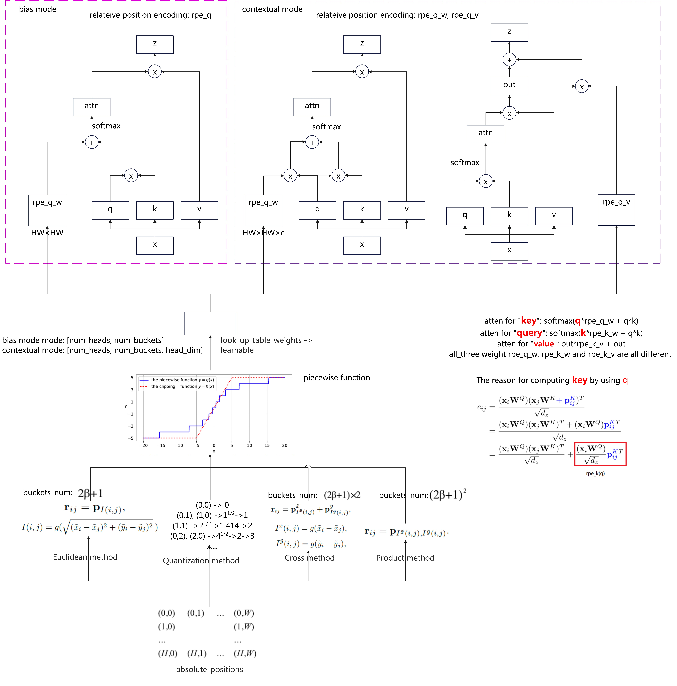

# transformer_pipeline
transformer_pipeline
## Support
- [x] [Attention is all you need](https://arxiv.org/abs/1706.03762)
- [x] ***ViT***: [AN IMAGE IS WORTH 16X16 WORDS: TRANSFORMERS FOR IMAGE RECOGNITION AT SCALE](https://openreview.net/pdf?id=YicbFdNTTy) 
- [x] ***Swin***: [Swin Transformer: Hierarchical Vision Transformer using Shifted Windows](https://arxiv.org/abs/2103.14030)
- [x] ***CSwin***: [CSWin Transformer: A General Vision Transformer Backbone with Cross-Shaped Windows](https://arxiv.org/pdf/2107.00652.pdf)
- [x] ***DETR***: [End-to-end Object Detection with Transformers](https://ai.facebook.com/research/publications/end-to-end-object-detection-with-transformers)
- [x] ***iRPE***: [Rethinking and Improving Relative Position Encoding for Vision Transformer](https://arxiv.org/abs/2107.14222)
- [x] ***DAT***: [Vision Transformer with Deformable Attention](https://arxiv.org/pdf/2201.00520.pdf)
- [x] ***CvT***: [CvT: Introducing Convolutions to Vision Transformers](https://arxiv.org/abs/2103.15808)
- [x] ***CrossViT***: [CrossViT: Cross-Attention Multi-Scale Vision Transformer for Image
Classification](https://arxiv.org/pdf/2103.14899)
- [x] ***SwinTrack***: [SwinTrack: A Simple and Strong Baseline for Transformer Tracking](https://arxiv.org/abs/2112.00995)
- [x] ***Stark***: [Learning Spatio-Temporal Transformer for Visual Tracking](https://openaccess.thecvf.com/content/ICCV2021/papers/Yan_Learning_Spatio-Temporal_Transformer_for_Visual_Tracking_ICCV_2021_paper.pdf)
- [] ***Swin-V2***: coming soon
## Performance Comparisons
Performance comparisons on ImageNet1K
|   method  | top-1 accuracy  |
|  ----  | ----  |
|  ViT-B"384 | 77.9 |
|  SwinV1-B"384 | 84.2 |
|  CSWin-B"384 | 85.4 |
|  iRPE base DeiT-B"224 | 82.4 |
|  DAT-B"384 | 84.8 |
|  CvT-21"384 | 84.9 |
|  CrossViT-18"384| 83.9 |
| SwinV2-B"384| 87.1|
## Figures
> Attention is all you need

---
> Vision Transformer

---
> SwinTransformer

---
> CSwinTransformer

---
> DETR

---
> iRPE: Rethinking Position Encoding

---
> Deformable Attention Transformer 

---
> CvT: Introducing Convolutions to Vision Transformers 

---
> CrossViT 

> SwinTrack 

> Stark 

